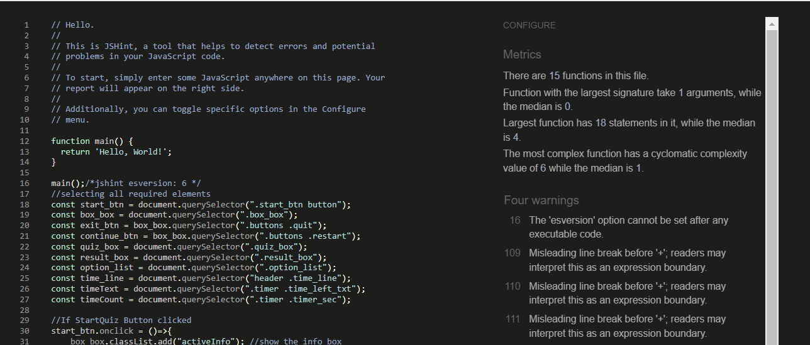

# Computer Quiz Game
####  This website has been created as the second Milestone project for Code Institute's Full Stack Software Development Diploma.In this project, i have created a fun & interactive, multiple-choice quiz. The aim of the game is to encourage the user to take part  test their general knowledge skills what he/she know about computer and have a bit of fun.

* It was built using HTML, CSS and JavaScript. 
 

 

 

Am I Responive 

 
 

# Table of Contents
 1. User Experience Design(UX)
 2. Future Features
     * Play area
     * Rules/instructions
     * Exit butten/Continue butten
     * Game area
     * Next box
     * Result area
     * Replay box/Quit box
     
     
2. Gols    
3. Home Page 
4. Rules/instructions
5. Scores counter
6. Deployment
7. Testing
8. Validator Testing
9. Bugs
10. Unfixed Bugs
11. Technologies used
12. Credits
13. Acknowledgements

   
   

## User Experience Design(UX)
  * As a User,
     * As a user, I want a website that is easy to navigate and understands the main 
       purpose of the site.
     * As a user, I want to view questions and answers about computers to get more knowledge.
     * As a user, I want clear instructions on how to play the game. 
      * As a user, I want there to be a score counter, that will keep track of the scores.
      * As a user, I want view the site on mobile/desktop/tablet.
        
        
   * As a returning user 
      * As a returning user, I want to play fast and smooth. without lags or accessibility defects affecting the overall experience.
      * As a returning user, I want the website to be continually updated with new features to keep me coming back and playing the game.

 
 

# Future features

### To  improve my website,and i would like to add additional in the future features like:-
1. To add more video games that are specially designed in the direction of knowledge learning by playing
2. To create dynamic and functional structures for with a variety of applications. 
3. To add different difficulty levels to make the experience more challenging.

 
 

###  Goals 
1. To provide users with a fun interactive game.
2. To test the user's general knowledge skills.
3. To make the quiz responsive 

 
 

## The Home Page 
#### When the user opens the webpage, the website with"Let's play" logo is the first page that will catch their attention.It is large and stands out as it identifies the game to them immediately.As soon as they see the logo page they will immediately know what it is that they are going to play once they open the webpage.
 
 
 

 
 

 
 

## Rules/nstructions
### The instructions for the game are shown directly after clicking the Let's play logo so that the user knows what to do before they start the challenge quiz.
### How many questions, how many seconds per question, what is allowed and what is not, To worry the player if exits without finishing the quiz the player loses, and for each question he gets points, and so on.
 
 

 
 

 
 
 
 

## Scores

### Once the user selects an answer they will see a correct or incorrect answer box.
### This scores are displayed if user score less than 1 it display "Sorry,You got only 1. if user scored more than 5 right answers it display "Good,You got only 5

 
 

 
 
 

* Quiz box page middle part consists of a question and a selection of answers area.
 

* If the timer stopped, the text "Time left" will change to "Time off".
 

 
 

* If the user start playing the Timer box apper on the right side "Time on"
 

# Deployment
### This website was deployed to GitHub pages. The steps to deploy are as follows:
   * In the GitHub repository, navigate to settings tab.
   * From the source section drop-down menu, select the Master Branch.
   * Once the Master Branch has been selected, the page provided the link to the completed website.
   
 
     
### 
# Testing

### Testing was a crucial part of my process to ensure my website performed as well as possible. Below I have detailed the steps I took to test my site comprehensively. I successfully tested my website in the following browsers: Chrome, Safari & Firefox. With the help of classmates and slack, I am confident my website works responsively on all popular devices including my own android 8.
 
 

# Validation Testing
   * HTML: No errors were returned when passing through the official W3C validator. Files tested:
    
    

 
 

   * CSS: No errors were found when passing through the official W3C validator. Files tested:
 

 
 

   * JS: was run through JSHint with these results. (There were also several missing semicolons that I added before taking this screenshot.)
Lighthouse Scores

 

 
 

## Bugs/Unfixed Bugs
 * I was getting warnings in jshint about ES6. Resolution found to clear these.
   * jsHint /jshint esversion:6/ added to the top of js file, removed warnings.
* Timer and time liner didn't run in sync. Corrected SetInterval. (JavaScript in easy steps by Mike McGrath)
* Timer didn't start counting from 20 decreasing straight away, showed at first previous answer time result.
   * Added timeCount.textContent = time to function startTimer. Solved this issue.

 * My biggest issue is still grammar mistakes. Need to pay more attention.
# Lighthouse
   * I tested he website on the Lighthouse testing in the chrome dev tools and the results are shown below.
     

   [lighthouse](assets/images/lighthouse.jpg)
   [lighthouse](assets/images/A%20lighthouse.png)

    
    

   

# Technologies Used

* HTML5
* CSS3
* javaScript
* Gitpod
* GitHub
* Google Fonts
* Chrome dev tools

## acknowledgements
  * I'd like to thank my classmate Roshna Vakkeel for the useful feedback direction and guidance.
  * Old student from Code Institute 
  * The Slack Community were amazing and helpe throughout my project.
   
# The following sites were used on a more regular basis:
   * I used W3C regularly for bug fixes and suggested features.
   * Stack Overflow
   * W3Schools
   * Free Code Camp

# Media
## All my Icons are from: Font Awesome
## My Font is from: Google Fonts
#### To provide icon to the result-box. https://fontawesome.com/
#### the youtube i used https://youtu.be/pQr4O1OITJo
#### conver images i used https://www.freeconvert.com/

     

           

 
	

