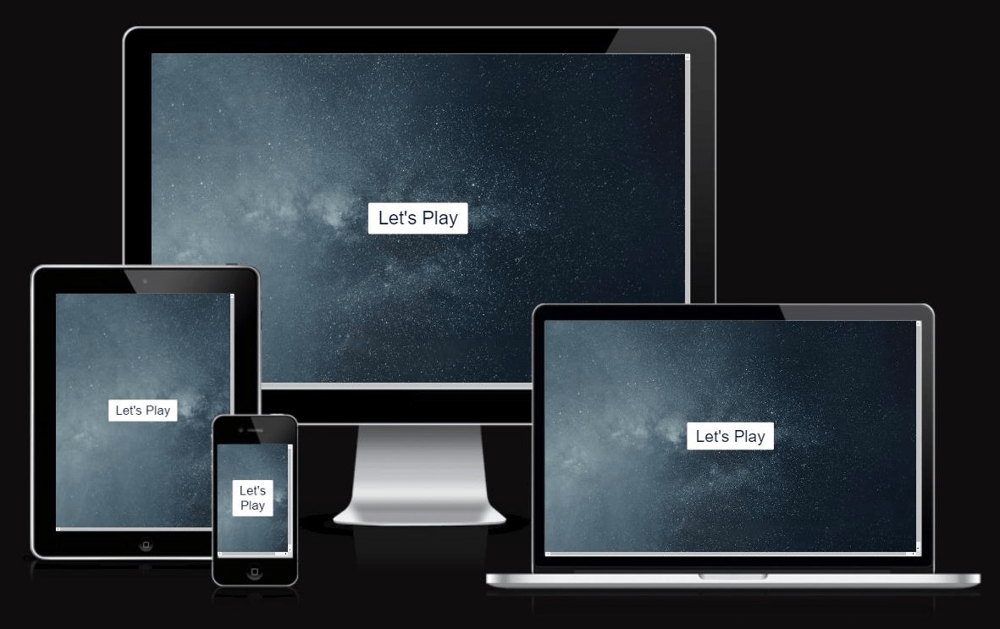
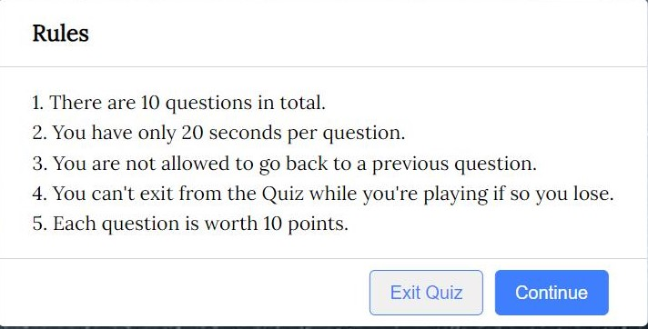

# Computer Quiz Game
####  This website has been created as the second Milestone project for Code Institute's Full Stack Software Development Diploma.In this project, i have created a fun & interactive, multiple-choice quiz. The aim of the game is to encourage the user to take part  test their general knowledge skills what he/she know about computer and have a bit of fun.
### It was built using HTML, CSS and JavaScript. 

Am I Responive 

# Table of Contents
 1. UX
 2. Future Features
     
     * Exit butten
     * Continue butten
     * Quiz area
     * Instructions
     * Result
     * Quiz area
     * Lose box
     * Replay box
     * Quit area
     

2. Scores
3. Rules/nstructions
3. Testing
4. Validator Testing
5. Bugs
6. Unfixed Bugs
7. Technologies used
8. Deployment
9. Credits
10. Acknowledgements

# In features

### TO  improve my website,and i would like to add additional in the future features like:-
1. To create dynamic and functional structures for with a variety of applications. 
2. TO add different difficulty levels to make the experience more challenging.
3. To add video games  that are especially designed in the direction of knowledge.

## The Home Page 
#### When the user opens the webpage, the website with"Let's play" logo is the first page that will catch their attention.It is large and stands out as it identifies the game to them immediately.As soon as they see the logo page they will immediately know what it is that they are going to play once they open the webpage.

## Rules/nstructions
### The instructions for the game are shown directly after clicking the Let's play logo so that the user knows what to do before they start the challenge quiz.
### How many questions, how many seconds per question, what is allowed and what is not, To worry the player if exits without finishing the quiz the player loses, and for each question he gets points, and so on.

## Scores

### Once the user selects an answer they will see a correct or incorrect answer box.
### This scores are displayed if user score less than 1 it display "Sorry,You got only 1. if user scored more than 5 right answers it display "Good,You got only 5

# Deployment
### This project was deployed to Github pages.
   * In your repository on Github click settings
   * Click the pages tab
   * On the drop-down menu under source, select your main branch
   * Click save
     
### 
# Testing

### Testing was a crucial part of my process to ensure my website performed as well as possible. Below I have detailed the steps I took to test my site comprehensively. I successfully tested my website in the following browsers: Chrome, Safari & Firefox. With the help of classmates and slack, I am confident my website works responsively on all popular devices.

# Validation
   * HTML: No errors were returned when passing through the official W3C validator. Files tested:
    

   * CSS: No errors were found when passing through the official W3C validator. Files tested:

   * JS was run through JSHint with these results. (There were also several missing semicolons that I added before taking this screenshot.)
Lighthouse Scores

### Goals 
- To provide users with a fun interactive game.
- To test the user's general knowledge skills.
- To make the quiz responsive
- To make the quiz responsive

 

 ## UX
 
### Goals 

- To make the quiz replayable through the use of 3 sets of questions with increasing levels of difficulty
- To make the quiz intuitive to use and provide satisfying  for the user

### To achieve these goals I used:

- Use JavaScript to create a fictional quiz
- Use CSS and HTML for the content and to make it look good
- Use relative and accurate source material for the quiz
- Use JavaScript to create a fictional quiz

## Functionality

## Questions and answers

## Response box

## Endquiz box

## Deployment

## Testing

## Validation

## Lighthouse Scores

## Technologies used

credits 
----

## Sources and References

## acknowledgements

# source 
#### To provide icon to the result-box. https://fontawesome.com/
#### the youtube i used https://youtu.be/pQr4O1OITJo

  **User Experience** 
  
   * Sub-nested bullet etc
***Features***
   * Header
   * Instraction
   * Scores
   * Quiz area/questions area
   * Game
   * Result
   * Win 
   **User Experience**

> This is a blockquote
>  *  This is a list item within a blockquote
>  *  This is a list item within a blockquote
>  *  This is a list item within a blockquote
* Bullet list
  *  Nested bullet
   * Sub-nested bullet etc
     * Bullet list item 2
* Sub-nested bullet etc
     * Bullet list item 3
     

1. Just type a number follow by a dot.
2. If you want to add a second item, just type in another number followed by a dot.
1. If you make a mistake when typing numbers, fear not, Markdown will correct for you. 
    1. If you press a tab key or type four spaces, you will get an indented list and the numbering will start from scratch.
        1. If you want to insert an indented numbered list within an existing indented numbered one, just press the tab key again. 
            - If need be, you can also add an indented unordered list within an indented numbered one, by pressing a tab key and typing adash.

            - If need be, you can also add an indented unordered list within an indented numbered one, by pressing a tab key and typing adash.

            - 
> This is a blockquote
   > * This is a list item within a blockquote
    > * This is a list item within a blockquote
            > * This is a list item within a blockquote            

 
	

